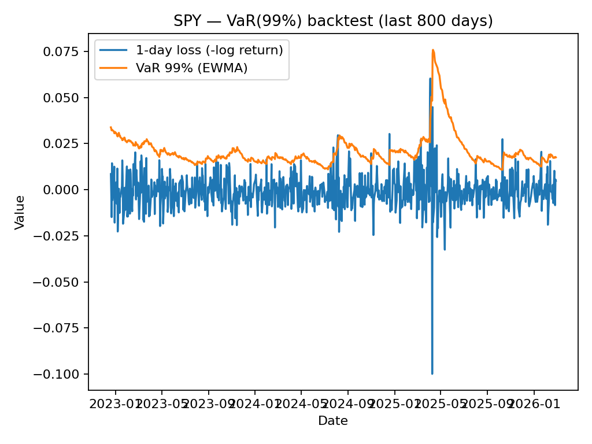

# Time Series Risk Engine (Volatility → VaR/ES)

> Work in progress — I’m building this incrementally and checking everything with walk-forward tests.  
> Last updated: 2026-03-02

This repo is a small risk engine that turns a volatility forecast into 1-day **VaR** / **Expected Shortfall (ES)** estimates, then checks whether those risk numbers actually hold up in a simple backtest.

The goal is not “one perfect model”, but a clean comparison of sensible baselines (EWMA, GARCH, different return distributions) with transparent evaluation.

## Results so far (SPY, 1-day 99% VaR)

- **EWMA + Normal VaR** breaches: **2.36%** (expected ~1.00%) → underestimates tail risk.
- **EWMA + Student-t (df=6) VaR** breaches: **1.77%** → improved, still higher than expected.

Interpretation: assuming Normal returns is too optimistic for equity tails; fat-tail assumptions help, but don’t fully solve it.

## Roadmap (next steps)
- [ ] Add a formal coverage test (Kupiec) and summarise results in a small table
- [ ] Implement **GARCH(1,1)** volatility forecasts
- [ ] Compare EWMA vs GARCH across calm vs stressed regimes
- [ ] Wrap everything into a single `run_all.py` pipeline for reproducibility

- Kupiec unconditional coverage test (df=1):  
  - EWMA + Normal: **LR = 70.80** (rejects correct 99% coverage)  
  - EWMA + Student-t: **LR = 25.48** (still rejects, but closer)

  ### VaR backtest (EWMA, 99%)
