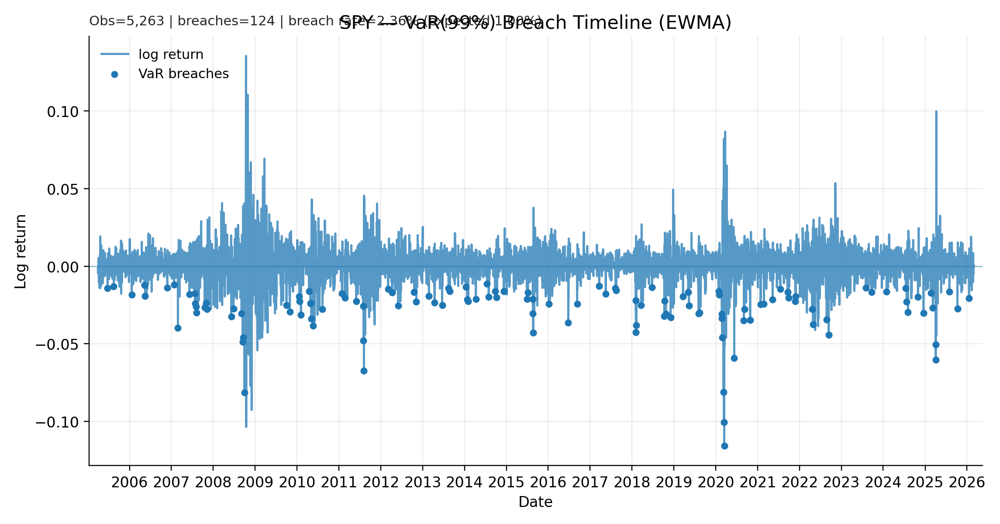
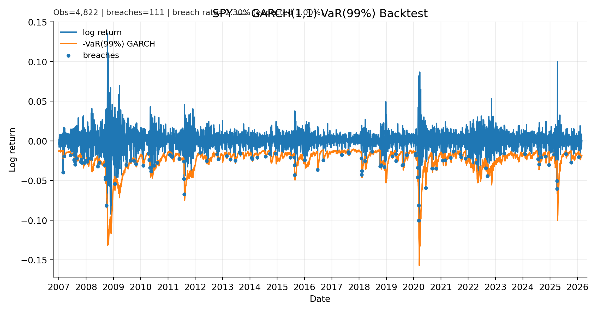

# Quant Risk Validation (VaR/ES) — EWMA vs Student-t vs GARCH

> Work in progress — I’m building this incrementally and checking everything with walk-forward tests.  
> Last updated: 2026-03-15

This repo is a small risk engine that turns a volatility forecast into 1-day **VaR** / **Expected Shortfall (ES)** estimates, then checks whether those risk numbers actually hold up in a simple backtest.

The goal is not “one perfect model”, but a clean comparison of sensible baselines (EWMA, GARCH, different return distributions) with transparent evaluation.

## Project structure

- `src/` — scripts (data download, feature engineering, risk models, backtests)
- `data/` — raw and processed datasets (generated locally)
- `reports/figures/` — key tracked outputs (plots embedded in this README)
- `reports/tables/` — tracked summary tables (CSV)
- `notebooks/` — exploration / scratch work

## What this project does

This repository builds a small, reproducible risk-model validation pipeline for daily ETF returns.

Given historical prices, it:

- downloads market data (SPY/TLT/GLD) and computes daily log returns
- estimates 1-day volatility using multiple models (EWMA, GARCH)
- converts volatility into **1-day 99% Value-at-Risk (VaR)** estimates under different distributional assumptions (Normal vs Student-t)
- evaluates the quality of VaR forecasts using:
  - simple breach-rate backtesting (expected ≈ 1% at 99% VaR)
  - Kupiec unconditional coverage test (LR statistic)
  - Christoffersen conditional coverage (coverage + independence)

The focus is not to “find one perfect model”, but to compare sensible baselines transparently, with tracked figures and clear diagnostics.

## Results so far (SPY, 1-day 99% VaR)

### Model comparison summary (SPY, 1-day 99% VaR)

| Model | Obs | Breach rate | Expected | Kupiec `LR_uc` | Christoffersen `LR_cc` |
|---|---:|---:|---:|---:|---:|
| EWMA + Normal | 5272 | 2.352% | 1.000% | 70.53 | 74.93 |
| EWMA + Student-t (df=6) | 5272 | 1.764% | 1.000% | 25.33 | 30.02 |
| GARCH(1,1) + Normal | 4831 | 2.298% | 1.000% | 60.15 | 60.89 |

- **EWMA + Normal VaR** breaches: **2.35%** (expected ~1.00%) → underestimates tail risk.
- **EWMA + Student-t (df=6) VaR** breaches: **1.76%** → improved, still higher than expected.
- Kupiec unconditional coverage test (df=1):  
  - EWMA + Normal: **LR = 70.53** (rejects correct 99% coverage)  
  - EWMA + Student-t: **LR = 25.33** (still rejects, but closer)

Kupiec p-values (Chi-square, df=1): see [`reports/tables/SPY_kupiec_summary_with_pvalues.csv`](reports/tables/SPY_kupiec_summary_with_pvalues.csv)

### Key takeaways

- EWMA + Normal VaR materially underestimates tail risk (breach rate ~2.35% vs expected 1%).
- Switching to a Student-t distribution improves coverage (breach rate ~1.76%), but still fails strict 99% tests.
- GARCH improves volatility dynamics, but the Normal tail assumption still leads to elevated breaches.

### Diagnostics plots

The plots below show the EWMA Normal-VaR threshold against realised 1-day losses, and highlight when the model is breached (loss exceeds VaR).

#### VaR backtest (EWMA, 99%)


#### Breach timeline (EWMA, 99%)

Markers indicate VaR exceptions (days where realised loss exceeds the predicted 99% VaR threshold).



### GARCH(1,1) VaR (99%) — Walk-forward backtest

- Obs used: 4,831
- Breaches: 111
- Breach rate: 2.2977%



### Christoffersen conditional coverage (independence + coverage)

This checks both:

- **coverage** (are breaches ~1% at 99% VaR?)
- **independence** (are breaches clustered or roughly independent over time?)

Results (LR statistics; lower is better):

- **EWMA + Normal**: `LR_uc` **70.56**, `LR_ind` **4.37**, `LR_cc` **74.93**
- **EWMA + Student-t (df=6)**: `LR_uc` **25.34**, `LR_ind` **4.68**, `LR_cc` **30.02**
- **GARCH(1,1) + Normal**: `LR_uc` **60.15**, `LR_ind` **0.74**, `LR_cc` **60.89**

**P-values (Chi-square approximation):**

- Kupiec `LR_uc` uses **df = 1**
- Christoffersen `LR_ind` uses **df = 1**
- Christoffersen `LR_cc` uses **df = 2**

Interpretation (rule of thumb): if **p < 0.05**, reject the model’s 99% VaR coverage assumptions.

| Model | Obs | Breaches | Breach rate | `LR_uc` | `p_uc` | `LR_ind` | `p_ind` | `LR_cc` | `p_cc` |
|---|---:|---:|---:|---:|---:|---:|---:|---:|---:|
| EWMA + Normal | 5272 | 124 | 2.352% | 70.56 | ~0.000 | 4.37 | ~0.037 | 74.93 | ~0.000 |
| EWMA + Student-t (df=6) | 5272 | 93 | 1.764% | 25.34 | ~0.000 | 4.68 | ~0.031 | 30.02 | ~0.000 |
| GARCH(1,1) + Normal | 4831 | 111 | 2.298% | 60.15 | ~0.000 | 0.74 | ~0.390 | 60.89 | ~0.000 |

Full summary table: [`reports/tables/SPY_christoffersen_summary_with_pvalues.csv`](reports/tables/SPY_christoffersen_summary_with_pvalues.csv)

## Reproducibility

The commands below are **examples** of how to run the pipeline (you do **not** need to run them unless you want to regenerate outputs).

```bash
# Environment setup
python3 -m venv .venv
source .venv/bin/activate
pip install -r requirements.txt

# Fast pipeline (recommended)
python -m src.download_data
python -m src.make_features
python -m src.risk_ewma
python -m src.risk_t_var_es
python -m src.backtest_var
python -m src.backtest_var_t
python -m src.kupiec_test
python -m src.christoffersen_test
python -m src.add_pvalues
python -m src.plot_breaches

# GARCH walk-forward VaR (slow; expanding-window refit)
python -m src.risk_garch
python -m src.backtest_var_garch
```